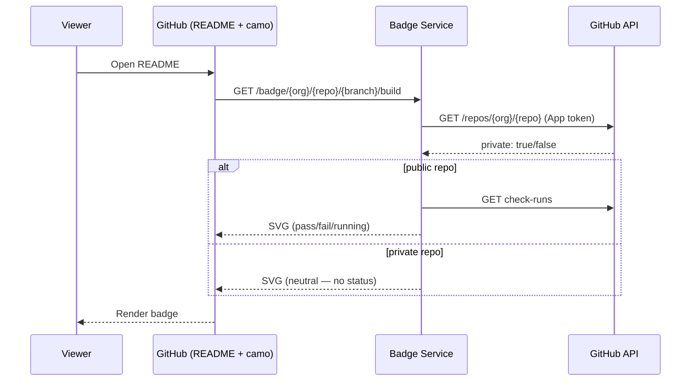

# 73. README Status Badges via Konflux Badge Service

Date: 2026-08-13

## Status

Proposed

## Context

### Problem

Teams want **embeddable build status** on the default branch README (Jenkins-style pass / fail / running). Konflux reports pipeline status as **GitHub Checks** (Checks tab), not GitHub Actions. There is no official GitHub URL that renders a Checks badge image.

Today, users must open the Konflux UI (SSO) or the GitHub Checks popup to see status. We want a **single dynamic URL** per repo that README can embed for **build**, **Enterprise Contract (EC)**, and later **Ring / release** data.

Beyond README badges, the same service can power **monitoring dashboards**, **portfolio status pages**, and **third-party integrations** (Slack bots, Jira, Confluence) via a JSON endpoint.

### Constraints

- README is rendered by GitHub — badge URL must be **reachable over public HTTPS**.
- Konflux primary API is **Kubernetes CRDs** ([architecture overview](https://konflux-ci.dev/architecture/)); user-facing HTTP endpoints are exceptional but have established precedent (Tekton Results ingress per [Pipeline Service](../architecture/core/pipeline-service.md) and [ADR-0009](0009-pipeline-service-via-operator.md), PaC webhook receiver per [ADR-0039](0039-workspace-deprecation.md), registration-service). The [architecture overview](../architecture/index.md) permits these exceptions when justified.
- Check runs are the status entries visible on each commit's **Checks tab** — the `-on-push` pipelines and `enterprise-contract` checks that PaC reports back to GitHub.
- Check names are **per-component** (`*-on-push`, `*enterprise-contract*`), not one org-wide GitHub check name.
- **Ring / release** status is not fully on GitHub Checks — requires cluster data (Tekton Results, Release CRs) later.
- Konflux runs on **multiple production clusters**, and tenants from the same GitHub organization may be spread across different clusters.
- Konflux onboarding data (Component CRs, tenant config) records **git URLs** but not GitHub repository visibility (public vs private). The proportion of private onboarded repos is unknown without querying the GitHub API per repository.

## Decision

Introduce a **Konflux Badge Service** — a new **read-only HTTP service** (hosted in its own repository, e.g. `konflux-ci/badge-service`) that:

1. Exposes **dynamic badge URLs** for onboarded repositories.
2. Returns **SVG badge images** for README embedding and **JSON** for programmatic consumers.
3. Uses the **paginated GitHub Checks API** initially for **build** and **EC** status on a branch HEAD.
4. Extends later to **Tekton Results / Konflux CRs** for Ring and richer status, within the same codebase.
5. Uses a **server-side GitHub credential** (GitHub App installation token stored in a Kubernetes Secret).

### Data flow

GitHub README images are fetched by GitHub's [camo proxy](https://docs.github.com/en/authentication/keeping-your-account-and-data-secure/about-anonymized-urls) — a plain HTTPS GET with **no viewer login** passed to the badge service. The badge service calls the GitHub API using the **PaC GitHub App** installation token (same App/credentials PaC uses to report check runs; stored in a cluster Secret).



**Public vs private (one URL, different response):** the service reads `repo.private` from the GitHub API. **Public** → fetch check runs, return real status SVG/JSON. **Private** → unauthenticated SVG returns a neutral badge only (no pass/fail); real status stays on GitHub Checks (for users with repo access). Returning real status for private repos on an open URL would let anyone who knows `org/repo/branch` learn build health without repo access.

### API shape

```
GET /badge/{githubOrg}/{githubRepo}/{branch}/build      → image/svg+xml
GET /badge/{githubOrg}/{githubRepo}/{branch}/ec         → image/svg+xml
GET /badge/{githubOrg}/{githubRepo}/{branch}/build.json → application/json
GET /badge/{githubOrg}/{githubRepo}/{branch}/ec.json    → application/json
```

The **SVG endpoints** return badge images for README embedding. The **JSON endpoints** return structured status data for programmatic consumers:

```json
{
  "org": "konflux-ci",
  "repo": "build-service",
  "branch": "main",
  "type": "build",
  "status": "passing",
  "sha": "abc123...",
  "updated": "2026-08-12T10:30:00Z"
}
```

- **Data path**: resolve branch HEAD SHA → paginate `GET /repos/{org}/{repo}/commits/{sha}/check-runs` → aggregate `*-on-push` / `enterprise-contract` → pass | fail | running.
- **Rendering**: `badge-maker` library ([MIT OR Apache-2.0](https://github.com/badges/shields/tree/master/badge-maker)) or equivalent minimal SVG — **not** shields.io SaaS `check-runs` route.
- **No tenant resolution needed initially**: The data source is the GitHub API, not cluster-internal data. The service only needs the GitHub org, repo, and branch to query check runs.

### README usage

```markdown

```

### Security and auth model

**Data exposure**: The endpoints expose **only aggregated pass / fail / running status**. No build logs, error messages, pipeline details, or secrets are returned. For public repositories, this status is already visible on GitHub's Checks tab without authentication, so the badge service does not increase the exposure surface. The badge endpoint is intentionally **unauthenticated** because GitHub's markdown renderer fetches badge images as an anonymous HTTP client. The architecture guidance to use `SubjectAccessReview` for exceptional HTTP endpoints does not apply here; that mechanism is for authenticated cluster API access. Phase 3 cluster data queries will use SAR-guarded access when reading Tekton Results or Release CRs.

**GitHub credential**: The service authenticates to the GitHub API using the **existing PaC GitHub App** on its hosting cluster ([Pipeline Service docs](../architecture/core/pipeline-service.md), [ADR-0039](0039-workspace-deprecation.md), [ADR-0009](0009-pipeline-service-via-operator.md)). Each Konflux cluster registers a separate GitHub App ([ADR-0039](0039-workspace-deprecation.md)); the badge service reads that cluster's App credentials (stored as a Kubernetes Secret). That App already has `checks:read` permission. No new GitHub App installation is required.

**Public endpoint protection**:

- **Rate limiting**: per-IP rate limiting (e.g. 60 requests/minute per IP) at the ingress level.
- **No secrets in URLs**: badge URLs contain only the GitHub org, repo, and branch — information that is already public for public repositories.

**Private repositories**: GitHub's image renderer cannot fetch badges for private repos (it makes an anonymous GET). Initially, private repo badges return a neutral "private" shield or a 404. Users of private repos can use the `.json` endpoint from authenticated contexts instead. A future signed-URL-with-TTL scheme could address this but requires further design.

### Caching and GitHub API rate limits

The [5,000 requests/hour](https://docs.github.com/en/apps/creating-github-apps/registering-a-github-app/rate-limits-for-github-apps) limit is **per GitHub App installation**, **shared with PaC** (check runs, webhooks, PR comments, etc.). Badge service must monitor `X-RateLimit-Remaining` and back off.

- Cache badge results per `{org}/{repo}/{branch}/{type}` (TTL 30–60s).
- Cache `repo.private` (~15 min).
- At 60s TTL, ~120 GitHub calls/hour per badge key. If ~3,000/hour is used by PaC, ~16 badge keys (~8 repos × 2 types) fit in the remainder under sustained load. Size TTL and repo count to **remaining** quota.

### Deployment model

**Initial deployment: single instance on one cluster.** Since the data source is the GitHub Checks API, the badge service does not need access to tenant namespaces for Phase 1. It deploys as a Deployment on a single Konflux cluster, reading that cluster's PaC GitHub App credentials. A Kubernetes Ingress or Route exposes it at a public URL. It serves badges only for repos where **its hosting cluster's** PaC GitHub App is installed and has `checks:read` access. Repos whose tenants are onboarded on other clusters use a different GitHub App per [ADR-0039](0039-workspace-deprecation.md); those repos require a badge service instance (or equivalent routing) on the cluster that owns that App installation.

**Evolution for cluster data sources.** When the service extends to read Tekton Results or Release CRs, it will need access to cluster-internal APIs. The deployment model evolves within the same codebase — new data source implementations are added. Two routing options exist:

1. **Per-cluster instances** behind a routing layer that directs requests to the correct cluster based on an org/repo → cluster mapping (derivable from the platform's tenant onboarding configuration).
2. **Central service** that queries Tekton Results APIs on remote clusters via their existing HTTP ingresses.

This decision is deferred because it depends on which cluster data sources are needed and how they expose their APIs.

### Rollout

**Phase 1 — GitHub Checks badges**:
1. Deploy the badge service on one Konflux cluster.
2. The service accepts any `{org}/{repo}` for which **its hosting cluster's** PaC GitHub App has installation access. No per-repo onboarding configuration is needed.
3. Support `build` and `ec` badge types (SVG and JSON).
4. Private repos get a neutral "private" badge.
5. Validate caching, rate limits, and SVG rendering in production.

**Phase 2 — Broader adoption**:
1. Promote the JSON endpoint for dashboard and monitoring use cases.
2. Consider webhook-based cache invalidation for near-real-time badge updates.

**Phase 3 — Cluster data sources**:
1. Extend to read Tekton Results for richer status (pipeline duration, last N runs).
2. Extend to read Release CRs for ring/release badges.
3. Evolve the deployment model to support cluster-internal data access (see Deployment model section).
4. Introduce tenant resolution (org/repo → cluster/namespace mapping) for cluster queries.

## Alternatives Considered

| Alternative | Evaluated | Verdict | Rationale |
|---|---|---|---|
| Shields.io SaaS `github/check-runs` | Live URLs on `konflux-ci/konflux-ci`, `konflux-ci/segment-bridge`; [source review](https://github.com/badges/shields/blob/master/services/github/github-check-runs.service.js) | **Rejected** | Reads only first ~30 check-run rows. Busy repos have 50–70+; Konflux `*-on-push` often at row 31+ → `no check runs`. Third-party SaaS; weak for private repos. |
| GitHub Action → commit `badge/*.svg` to repo | Prototype workflow | **Rejected** | Mixes CI status into source; per-repo maintenance; |
| Tekton task → git push SVG | Design review | **Rejected** | Same concerns as git-commit approach. |
| Deploy per-cluster from the start | Design review | **Deferred** | Unnecessary for GitHub-only data path. Adds deployment complexity without benefit until the service reads cluster-internal data. |
| Extend Tekton Results with a badge endpoint | Design review | **Rejected** | Tekton Results is an upstream project (`tektoncd/results`) — adding Konflux-specific badge logic there is out of scope. Bearer token auth incompatible with GitHub's anonymous image fetching. Badge service reads GitHub Checks (reported by PaC), not raw PipelineRun results. |
| JSON-only service + self-hosted Shields for SVG | Design review | **Rejected** | Requires deploying two services. `badge-maker` renders SVG trivially; single service serving both JSON and SVG is simpler to operate. |

## Consequences

### Positive

- One **org-standard** badge URL pattern for all onboarded repos.
- **No git noise** — status stays outside source control.
- **Paginated** GitHub access — fixes Shields 30-row limit.
- **Extensible** to Ring/release via cluster APIs without changing README embed pattern.
- Spike CLI logic maps directly to service handlers.
- **Broader utility**: the JSON endpoint enables dashboards, Slack integrations, and portfolio views.
- **Simple initial deployment**: single instance on one cluster, reusing PaC's existing GitHub App credentials.
- **Follows established precedent**: public HTTP endpoints exist in Konflux (Tekton Results, PaC webhook receiver, registration-service).

### Negative / compromises

- **New operational component**: deploy, monitor, rate-limit, and secure a public HTTP endpoint.
- **Private repo limitation**: badges unavailable for private repos until a signed-URL scheme is designed.
- **Cache staleness**: badge status may lag real-time by up to 60 seconds.
- **Shared GitHub API rate limit**: badge service competes with PaC for the same 5,000/hour per installation; must monitor remaining quota and size cache TTL accordingly.
- **GitHub API dependency**: if GitHub is down or rate-limited, badges degrade to a "status unknown" state.
- **Deployment model must evolve**: adding cluster-internal data sources requires per-cluster deployment or a routing layer, which will need its own design work.
- **Exceptional HTTP endpoint**: adds another exception to the "kube API server is the API server" constraint, justified by the use case and mitigated by the read-only, minimal-data nature of the endpoint.

## References

- [Architecture overview — constraints on HTTP endpoints](../architecture/index.md)
- [Pipeline Service — Tekton Results ingress and GitHub App](../architecture/core/pipeline-service.md)
- [ADR-0009 Pipeline Service via Operator](0009-pipeline-service-via-operator.md) — Tekton/PaC deployment model
- [ADR-0039 Workspace Deprecation — per-cluster GitHub App model](0039-workspace-deprecation.md)
- [GitHub Apps rate limits](https://docs.github.com/en/apps/creating-github-apps/registering-a-github-app/rate-limits-for-github-apps) — 5,000 requests/hour per installation (shared)
- [badge-maker library](https://github.com/badges/shields/tree/master/badge-maker) — MIT/Apache-2.0 SVG generation
- [GitHub camo proxy](https://docs.github.com/en/authentication/keeping-your-account-and-data-secure/about-anonymized-urls) — how GitHub proxies images in README files
